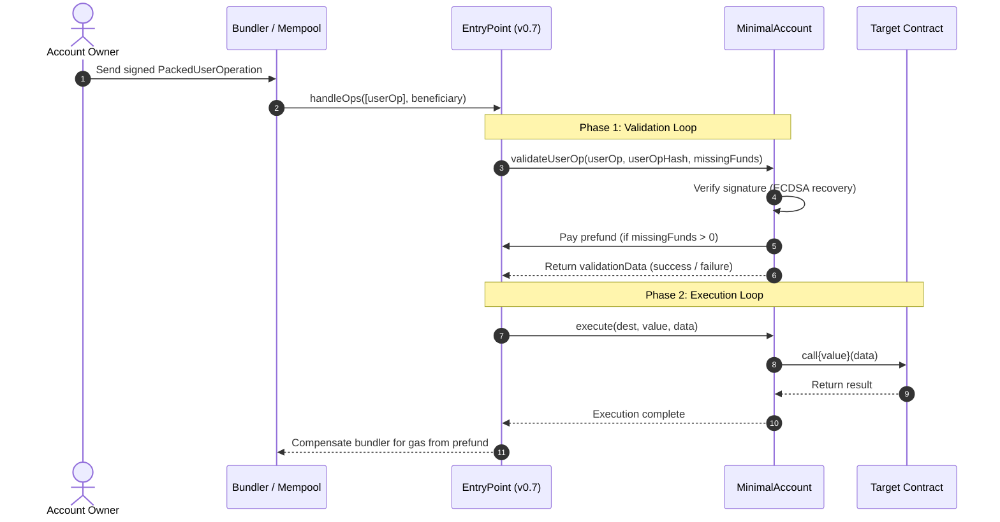

# Foundry Account Abstraction (ERC-4337 & zkSync Era)

[](https://github.com/<OWNER>/<REPOSITORY>/actions)
[](https://opensource.org/licenses/MIT)
[](https://getfoundry.sh/)
[](https://soliditylang.org/)

An advanced, modular smart contract wallet implementation demonstrating **Account Abstraction** across both **Ethereum (ERC-4337)** and **zkSync Era (Native AA)** using the [Foundry](https://getfoundry.sh/) development framework.

---

## 📑 Table of Contents

- [About the Project](#-about-the-project)
- [Account Abstraction Overview](#-account-abstraction-overview)
  - [Ethereum (ERC-4337)](#1-ethereum-erc-4337)
  - [zkSync Era (Native AA)](#2-zksync-era-native-aa)
- [System Architecture](#-system-architecture)
  - [ERC-4337 Transaction Flow](#erc-4337-transaction-flow)
- [Contract Overview](#-contract-overview)
  - [`MinimalAccount.sol`](#minimalaccountsol)
- [Project Structure](#-project-structure)
- [Getting Started](#-getting-started)
  - [Prerequisites](#prerequisites)
  - [Installation & Setup](#installation--setup)
- [Usage](#-usage)
  - [Build](#build)
  - [Test](#test)
  - [Format](#format)
  - [Gas Snapshot](#gas-snapshot)
- [Foundry Configuration](#-foundry-configuration)
- [Roadmap](#-roadmap)
- [Resources & References](#-resources--references)
- [License](#-license)

---

## 📖 About the Project

Traditional Ethereum accounts are **Externally Owned Accounts (EOAs)**, tied directly to a single private-public key pair. EOAs have hardcoded signature validation (ECDSA over secp256k1) and must initiate all transactions and pay their own gas fees directly in ETH.

**Account Abstraction (AA)** turns user accounts into smart contracts ("smart contract wallets"), decoupling the account authorization logic from the EVM execution layer. This unlocks:

- **Custom Signature Schemes**: Multicall, multisig, passkeys (WebAuthn/P-256), session keys.
- **Gas Abstraction & Sponsorship**: Pay gas in ERC-20 tokens or have third parties (Paymasters) sponsor user gas.
- **Batched Transactions**: Approve and swap in a single atomic transaction.
- **Social Recovery & Key Rotation**: Recover wallet access without relying on a single seed phrase.

This repository explores and implements Account Abstraction from the ground up on:
1. **Ethereum** via the canonical **ERC-4337** infrastructure (`EntryPoint` v0.7, `PackedUserOperation`, `IAccount`).
2. **zkSync Era** via native protocol-level account abstraction.

---

## 🔍 Account Abstraction Overview

### 1. Ethereum (ERC-4337)
Ethereum does not support native AA on Layer 1 without a hard fork. Instead, ERC-4337 introduces an alternative mempool:
- Users construct a **`UserOperation`** (or `PackedUserOperation` in v0.7).
- Specialized nodes called **Bundlers** package user operations into an Ethereum transaction calling a singleton **`EntryPoint`** contract.
- The `EntryPoint` handles account validation (`validateUserOp`), prefunding, and execution.

### 2. zkSync Era (Native AA)
zkSync Era integrates Account Abstraction natively into the core protocol:
- The `bootloader` treats every account as a smart contract.
- Accounts implement zkSync's `IAccount` interface (`validateTransaction`, `executeTransaction`).
- No separate `EntryPoint` or alternative mempool required.

---

## 🏗 System Architecture

### ERC-4337 Transaction Flow



---

## 📜 Contract Overview

### `MinimalAccount.sol`
Location: [`src/ethereum/MinimalAccount.sol`](file:///d:/foundry/adv-foundry-abstraction-f26/src/ethereum/MinimalAccount.sol)

A minimal, secure smart contract wallet implementing `IAccount` from the ERC-4337 standard:

- **Entry Point Gating**: Restricts `validateUserOp` execution exclusively to the configured `EntryPoint` address (`requiredFromEntryPoint` modifier).
- **Signature Verification (`_validateSignature`)**:
  - Reconstructs the Ethereum signed message hash using OpenZeppelin's `MessageHashUtils.toEthSignedMessageHash`.
  - Recovers the signer via `ECDSA.recover` and compares with the contract `owner()`.
  - Returns `SIG_VALIDATION_SUCCESS` (0) or `SIG_VALIDATION_FAILED` (1).
- **Gas Prefund (`_payPrefund`)**:
  - Automatically deposits any `missingAccountFunds` back to the `EntryPoint` contract to guarantee gas compensation for the bundler.
- **Direct & EntryPoint Execution**: Allows execution of arbitrary transactions routed through the EntryPoint or directly by the wallet owner.

---

## 📁 Project Structure

```text
adv-foundry-abstraction-f26/
├── .github/
│   └── workflows/
│       └── test.yml                 # Automated CI workflow (fmt, build, test)
├── lib/
│   ├── account-abstraction/        # Canonical ERC-4337 v0.7 contracts & interfaces
│   ├── forge-std/                  # Foundry standard library
│   └── openzeppelin-contracts/     # OpenZeppelin cryptography & access control
├── script/                         # Deployment & UserOp generation scripts
├── src/
│   ├── ethereum/
│   │   └── MinimalAccount.sol      # ERC-4337 Smart Contract Wallet implementation
│   └── zksync/                     # zkSync native account abstraction contracts
├── test/
│   ├── ethereum/                   # Unit & staging tests for MinimalAccount
│   └── zksync/                     # zkSync account abstraction tests
├── foundry.toml                    # Foundry configuration (via-ir, optimizer, remappings)
└── README.md
```

---

## 🚀 Getting Started

### Prerequisites

Ensure you have the following installed:

- **[Git](https://git-scm.com/)**
- **[Foundry](https://getfoundry.sh/)** (`forge`, `cast`, `anvil`)

To install Foundry:
```bash
curl -L https://foundry.paradigm.xyz | bash
foundryup
```

### Installation & Setup

1. **Clone the repository with submodules**:
   ```bash
   git clone --recursive https://github.com/<YOUR-USERNAME>/adv-foundry-abstraction-f26.git
   cd adv-foundry-abstraction-f26
   ```

   *If already cloned without `--recursive`:*
   ```bash
   git submodule update --init --recursive
   ```

2. **Verify the installation**:
   ```bash
   forge --version
   ```

---

## 🛠 Usage

### Build
Compile the smart contracts with the via-IR pipeline enabled:
```bash
forge build
```

### Test
Run the automated test suite:
```bash
forge test
```

Run tests with detailed traces:
```bash
forge test -vvvv
```

### Format
Check code formatting across the repository:
```bash
forge fmt --check
```

Format code:
```bash
forge fmt
```

### Gas Snapshot
Generate gas usage snapshots for your contracts:
```bash
forge snapshot
```

---

## ⚙️ Foundry Configuration

The project uses advanced Foundry settings specified in [`foundry.toml`](file:///d:/foundry/adv-foundry-abstraction-f26/foundry.toml):

```toml
[profile.default]
src = "src"
out = "out"
libs = ["lib"]
remappings = ['@openzeppelin/contracts=lib/openzeppelin-contracts/contracts']
is-system = true
via-ir = true
optimizer = true
fs_permissions = [
    { access = "read", path = "./broadcast" },
    { access = "read", path = "./reports" },
]
```

- **`via-ir = true`**: Enables the Solidity Intermediate Representation pipeline, required for complex memory and calldata structures in ERC-4337 `PackedUserOperation`.
- **`optimizer = true`**: Optimizes EVM bytecode output for gas efficiency.
- **`fs_permissions`**: Allows scripts to inspect broadcasts and reports for automation.

---

## 🗺 Roadmap

- [x] ERC-4337 `MinimalAccount` validation loop and EntryPoint integration.
- [ ] UserOp signing script (`PackedUserOperation` generation and EIP-191 / EIP-712 signing).
- [ ] Execute arbitrary transactions via `EntryPoint` and directly from owner.
- [ ] zkSync Era native smart account implementation (`IAccount` bootloader flow).
- [ ] Custom Paymaster implementation (ERC-20 gas payments).
- [ ] Unit and fork testing against Sepolia / Anvil with mock `EntryPoint`.

---

## 📚 Resources & References

- [ERC-4337 Specification](https://eips.ethereum.org/EIPS/eip-4337)
- [eth-infinitism/account-abstraction GitHub](https://github.com/eth-infinitism/account-abstraction)
- [zkSync Account Abstraction Docs](https://docs.zksync.io/build/developer-reference/account-abstraction)
- [Foundry Book](https://book.getfoundry.sh/)
- [OpenZeppelin Contracts](https://github.com/OpenZeppelin/openzeppelin-contracts)

---

## 📄 License

This project is open source and available under the [MIT License](LICENSE).
# adv-foundry-abs-wallet-f26
